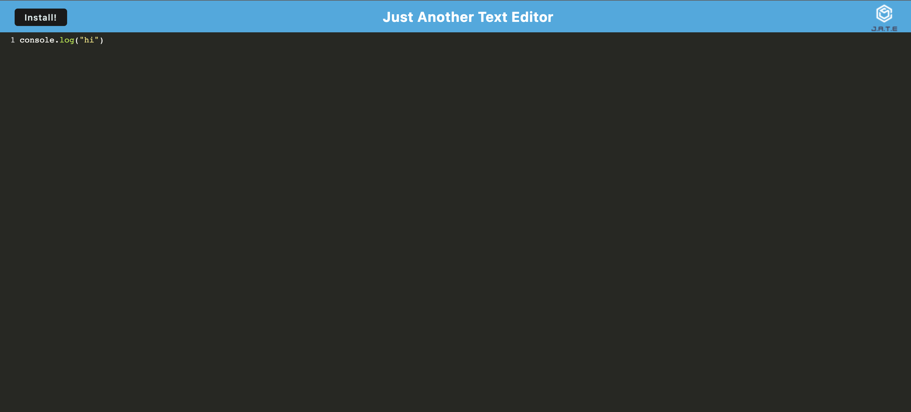

# PWAtextEditor
This application that allows the user to create notes or code snippets with or without an internet connection
### Intallation:
to install the dependencies open the terminal and run:
npm i 
npm start

### screenshot:

### Links
[github](https://github.com/mmontoya1112/PWAtextEditor)

[heroku](https://ancient-thicket-56051.herokuapp.com/)